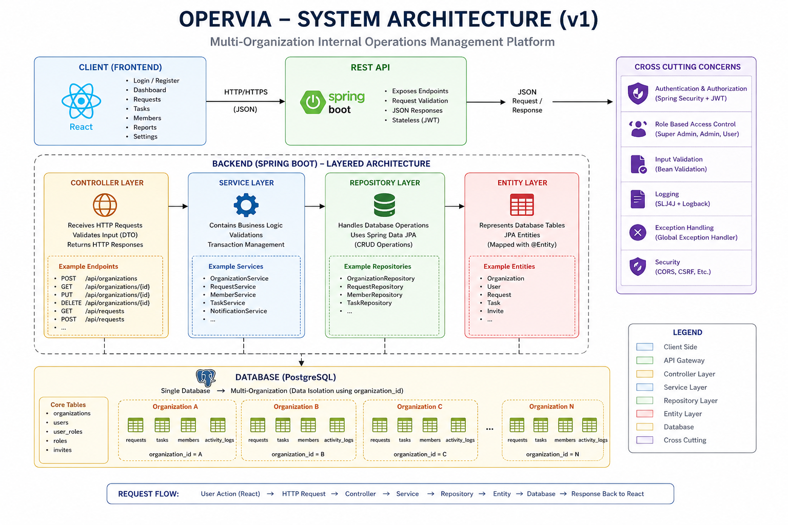
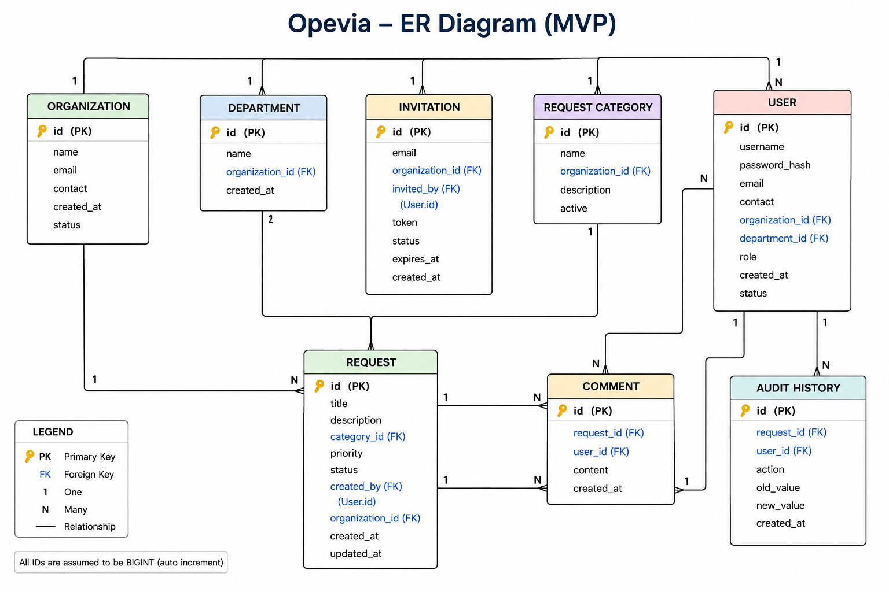

# Opervia Documentation

This folder contains the project documentation and design documents.

## Documents

- [Product Requirements Document](./OPERVIA-PRD.pdf)
- [Architecture Document](./architecture.md)
- [Architecture Diagram](./OPERVIA-Architecture_V1.png)
- [Database Domain Model](./database.md)
- [ER Diagram](./OPERVIA-ER-Diagram.png)

## Project Design

### Architecture

### Database ER Diagram

